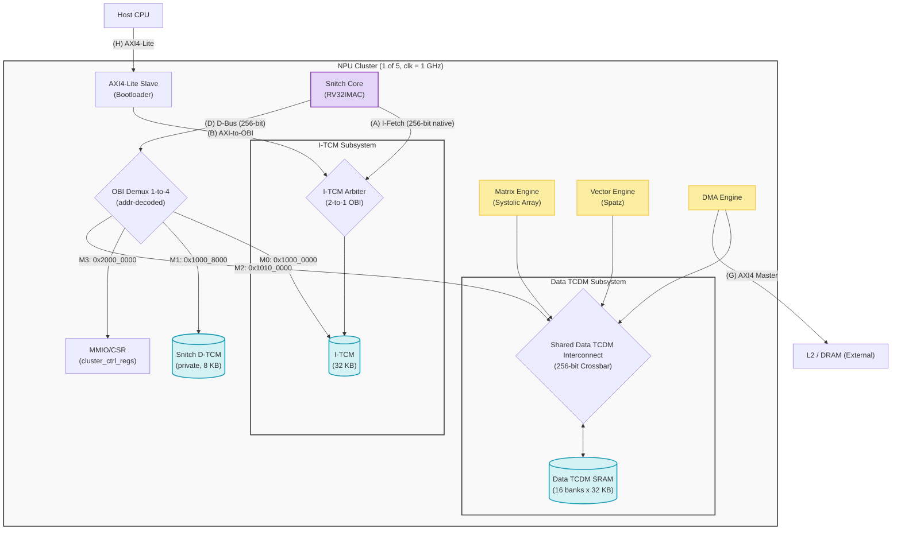

# YOLO NPU Architecture Specification

**Version**: Phase 3A — Snitch Core Integration (Boot Verified)  
**Last Updated**: 2026-06-15

---

## 1. Architectural Overview

The YOLO NPU is a heterogeneous compute architecture designed to achieve 10 TOPS. Deeply optimized for the YOLO family of models, it supports INT8 quantized inference.

To achieve high-performance matrix and vector operations, the architecture integrates 5 parallel **NPU Clusters**. Each cluster features:

1. **Control Core (Snitch)**: A RISC-V RV32IMAC scalar core. Boots from local I-TCM firmware, controls and dispatches compute commands to the Matrix and Vector engines via OBI.
2. **Matrix Engine** *(Phase 3B)*: A 32×32 INT8 Systolic Array optimized for Dense MatMul / Conv2D.
3. **Vector Engine** *(Phase 3B)*: A Spatz RVV co-processor for Depthwise Conv, Element-wise ops, and Non-linear Activations (SiLU, Softmax).
4. **Shared Data TCDM**: A 256-bit wide L1 data memory shared between the Systolic Array, Vector Engine, and DMA.
5. **DMA Engine**: Handles burst data movement between AXI external memory (L2/DRAM) and Data TCDM autonomously, without involving Snitch.

---

## 2. Cluster Micro-Architecture & Interfaces



### Interface Reference

| ID | Name | Protocol | Width | Description |
|----|------|----------|-------|-------------|
| A  | I-Fetch | OBI | 256-bit | Snitch instruction fetch từ I-TCM (native width) |
| B  | AXI4-Lite Slave | AXI4-Lite | 32-bit | Host/bootloader ghi firmware vào I-TCM qua AXI |
| C  | I-TCM Arbiter | OBI Arbiter 2→1 | 256-bit | Phân giải I-TCM giữa Bootloader và Snitch |
| D  | Snitch D-Bus | OBI | 256-bit | Bus dữ liệu chính của Snitch Core |
| E  | OBI Demux 1→4 | OBI | 256-bit | Định tuyến data bus: I-TCM / D-TCM / Shared TCDM / MMIO |
| F  | Data TCDM Port | OBI | 256-bit | Master Port từ Demux vào Shared Data TCDM |
| G  | DMA AXI Master | AXI4 | 128-bit | DMA tự load dữ liệu từ L2/DRAM vào Data TCDM |
| H  | Host AXI4-Lite | AXI4-Lite | 32-bit | Kết nối từ Host xuống Cluster để nạp boot firmware |

---

## 3. Memory Map (Per Cluster)

| Address Range | Size | Module | Vai trò |
|--------------|------|--------|---------|
| `0x1000_0000 – 0x1000_7FFF` | 32 KB | **I-TCM** | Firmware Snitch (instruction). Đọc/ghi qua D-Bus M0. |
| `0x1000_8000 – 0x1000_BFFF` | 8 KB  | **Snitch D-TCM** | Private data (stack, scalars) qua D-Bus M1. |
| `0x1010_0000 – 0x101F_FFFF` | 1 MB  | **Shared Data TCDM** | Weights, IFM, OFM (chia cho tất cả compute units). |
| `0x2000_0000 – 0x2000_FFFF` | 64 KB | **MMIO / CSR** | `cluster_ctrl_regs`, cấu hình DMA. |

> **Tại sao tách I-TCM và D-TCM?**  
> Harvard Architecture: Snitch fetch lệnh qua I-Fetch (không cạnh tranh băng thông với D-Bus). D-TCM private đảm bảo 1-cycle latency cố định cho stack/local vars bất kể DMA hay Systolic Array đang chiếm Shared Data TCDM.

---

## 4. Boot Sequence

```
1. Host ghi firmware vào I-TCM qua AXI4-Lite Slave (cổng B/H)
   → AXI-to-OBI bridge → I-TCM Arbiter → I-TCM SRAM
   
2. Host de-assert rst_ni

3. Snitch core reset → PC = 0x1000_0000 (BootAddr)

4. Snitch fetch instruction từ I-TCM (cổng A, qua Arbiter)

5. Snitch thực thi firmware:
   - Khởi tạo D-TCM (stack setup)
   - Cấu hình cluster_ctrl_regs qua MMIO (cổng M3)
   - (Phase 3B) Trigger DMA để load weight vào Data TCDM
   - (Phase 3B) Dispatch lệnh tới Systolic Array
   - (Phase 3B) Dispatch lệnh RVV tới Spatz

6. Snitch ghi 0xDEADBEEF vào địa chỉ MMIO signature
   → Host đọc để xác nhận boot thành công
```

---

## 5. SRAM Allocation Analysis (2.5 MB Budget)

Tổng on-chip SRAM budget: **2.5 MB (2560 KB)**.

### A. NPU Manager Subsystem (Top-Level): 80 KB

| Bank | Size | Vai trò |
|------|------|---------|
| I-TCM | 32 KB | Firmware orchestration (tiling, scheduling) |
| D-TCM | 48 KB | Stack và graph topology data structures |

### B. NPU Clusters (5 × 496 KB = 2480 KB)

| Bank | Size | Địa chỉ | Vai trò |
|------|------|---------|---------|
| I-TCM | 32 KB | `0x1000_0000` | Cluster firmware |
| Snitch D-TCM | 8 KB | `0x1000_8000` | Private scalar data |
| Weight Buffer | 2 × 128 KB | Data TCDM | Ping-pong weight stationary |
| IFM Buffer | 2 × 50 KB | Data TCDM | Input feature map tiles |
| OFM Buffer | 2 × 50 KB | Data TCDM | Output / INT32 accumulator |

**Memory Latency Hiding**: Double-buffering (Ping-Pong) cho phép DMA prefetch tile kế tiếp vào Bank 1 trong khi Systolic Array xử lý Bank 0 → hardware utilization ~100%.

---

## 6. Development Phases

| Phase | Nội dung | Trạng thái |
|-------|----------|-----------|
| 1 | DMA Engine + AXI interface | ✅ Done |
| 2 | Data TCDM Interconnect (N-bank crossbar) | ✅ Done |
| 2.5 | AXI→OBI bridge, DMA-to-TCM test | ✅ Done |
| **3A** | **Snitch Core Integration: I-TCM, D-TCM isolation, Boot via AXI** | **✅ Done** |
| 3B | Systolic Array + Spatz integration (1 GHz cluster) | ⬜ Planned |
| 4 | Top-Level: 5-cluster integration + Manager Snitch | ⬜ Planned |
| 5 | Full YOLO layer end-to-end simulation | ⬜ Planned |

---

## 7. Hardware Verification Plan

### Unit Testing (Block-Level)
- **Snitch Boot TB** (`test_snitch_boot`): Nạp firmware qua AXI4-Lite, release reset, xác nhận Snitch viết signature `0xDEADBEEF` vào MMIO. *(Passed)*
- **I-TCM Arbiter TB**: Kiểm tra ưu tiên AXI vs Snitch, không có collision. *(Passed)*
- **OBI Demux TB**: Kiểm tra address decoding chính xác (I-TCM / D-TCM / Data TCDM / MMIO). *(Passed)*
- **Matrix Engine TB** *(Phase 3B)*: Verify 32×32 Systolic Array vs Python golden model.
- **Spatz Vector TB** *(Phase 3B)*: Test RVV instructions.

### Cluster-Level Verification
- **TCDM Arbitration**: Snitch, Spatz, Systolic Array đồng thời access Data TCDM → không deadlock.
- **Firmware Dispatch**: Snitch firmware trigger DMA, DMA load data, Systolic Array compute.

### Top-Level Integration
- **5-Cluster TB**: Tất cả 5 cluster chạy đồng thời, Manager Snitch phân chia tiling.
- **End-to-End**: Mô phỏng full YOLO layer (Conv2D 3×3): External Memory → DMA → TCDM → Compute → Writeback.
- **Performance Profiling**: Đo cycle count thực tế → tính TOPS thực tế vs mục tiêu 10 TOPS.
