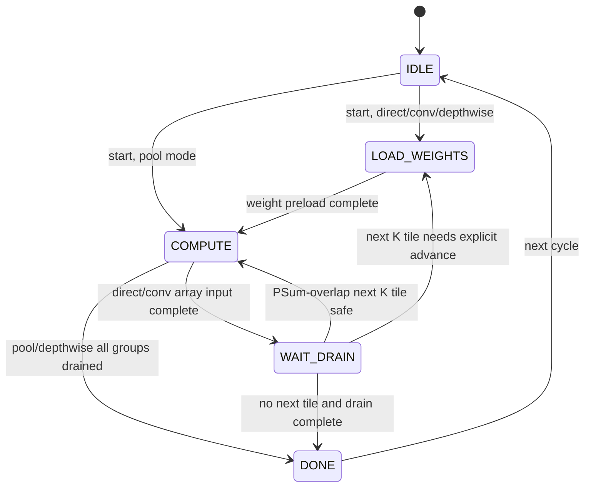

# Systolic Array Architecture Specification

**Version**: Current implemented cluster baseline
**Last Updated**: 2026-09-10

This document describes the RTL/software behavior that is currently implemented
in the Neural AI repository. It is not a wishlist architecture. When a feature
is exposed in the register map but not used as an independent scheduling knob,
that limitation is called out explicitly.

Primary source references:

- RTL controller: `hw/rtl/systolic/systolic_controller.sv`
- MMIO/shadow registers: `hw/rtl/systolic/systolic_ctrl_regs.sv`
- Array datapath: `hw/rtl/systolic/npu_systolic_array.sv`
- Linebuffer/window packer: `hw/rtl/systolic/conv_linebuf_stream_packer.sv`
- Output drain: `hw/rtl/systolic/systolic_output_drain.sv`
- Output postprocess shell: `hw/rtl/systolic/systolic_output_postprocess.sv`
- Requant pipeline: `hw/rtl/systolic/requant_pipeline.sv`
- General binary post-op pipeline: `hw/rtl/systolic/binary_requant_pipeline.sv`
- Binary operand prefetch: `hw/rtl/systolic/binary_operand_stream.sv`
- Depthwise MAC datapath: `hw/rtl/systolic/depthwise_mac_engine.sv`
- Firmware register definitions: `sw/lib/npu_memory_map.h`
- Operator-level usage: `docs/operator_support_matrix.md`

---

## 1. Architectural Overview

The systolic subsystem is an INT8 matrix/streaming-convolution accelerator
integrated inside the NPU cluster. It is controlled by Snitch through the
cluster MMIO aperture at `NPU_CTRL_BASE = 0x2000_0000` and accesses shared TCDM
through dedicated OBI masters.

The current subsystem contains these blocks:

- a `32x32` INT8 systolic array with INT32 accumulators;
- a controller FSM with direct GEMM, linebuffer Conv, pool, and depthwise modes;
- a banked row-ring/window linebuffer for Conv/Pool/Depthwise input streams;
- a 3-stage INT32-to-INT8 requant pipeline;
- an optional 10-stage, 32-lane quantized Add/Sub/Mul post-op pipeline;
- a credit-controlled operand-B prefetch stream with multiple OBI reads in
  flight;
- an OFM FIFO and a PSum FIFO for drain/read decoupling;
- a 64 KiB dual-bank on-chip PSum buffer for multi-K-tile accumulation;
- a shadow-register MMIO file so firmware can preload a full job and atomically
  commit it with `REG_SYS_START`.

```mermaid
graph TD
    subgraph "NPU Cluster"
        Snitch["Snitch RV32IMAC Control Core"]
        Regs["systolic_ctrl_regs<br/>MMIO + shadow regs"]
        Ctrl["systolic_controller"]
        LB["conv_linebuf_stream_packer<br/>banked row-ring/window"]
        DW["depthwise_mac_engine"]
        Pool["systolic_maxpool_engine"]
        Array["32x32 npu_systolic_array"]
        subgraph Drain["systolic_output_drain"]
            PSum["OFM/PSum FIFOs + 2-bank PSum buffer"]
            subgraph Post["systolic_output_postprocess"]
                RQ["requant_pipeline"]
                BRQ["binary_requant_pipeline<br/>optional Add/Sub/Mul"]
                BFetch["binary_operand_stream<br/>credit + response FIFO"]
            end
        end
        TCDM["Shared TCDM"]
    end

    Snitch -->|OBI MMIO| Regs
    Regs -->|active config| Ctrl
    Ctrl -->|obi_w: weight read| TCDM
    Ctrl -->|obi_i: IFM / linebuffer read| TCDM
    TCDM -->|IFM beats| LB
    LB -->|C32 vectors / tap vectors| Ctrl
    Ctrl -->|weights + IFM| Array
    LB -->|depthwise taps| DW
    LB -->|pool taps| Pool
    Ctrl -->|lifecycle + tile metadata| Drain
    Array -->|INT32 rows| Drain
    DW -->|INT32 rows| Drain
    Pool -->|INT8 rows| Drain
    PSum -->|selected INT32 rows| RQ
    RQ -->|lhs INT8 rows| BRQ
    BFetch -->|obi_b: rhs read| TCDM
    TCDM -->|rhs INT8 rows| BFetch
    BFetch -->|ready/valid rhs| BRQ
    BRQ -->|final INT8 rows| Drain
    RQ -->|bypass when binary disabled| Drain
    Drain -->|obi_o[3:0]: psum read / output write| TCDM
```

Important mismatch with older notes: the updated controller interface has
**three dedicated read masters**. `obi_i` is used for direct IFM and linebuffer
reads, `obi_w` is used for weight reads, and `obi_b` fetches the independent
INT8 operand for a fused binary post-op. The four `obi_o` ports are output-side
OBI masters and are also used for external PSum reads when accumulation must
read old partial sums from TCDM.

---

## 2. Microarchitecture

### 2.1 Systolic Array Core

| Property | Current value |
|---|---:|
| Array size | `32 x 32` processing elements |
| Activation/weight lane width | INT8 |
| Input vector width | 256 bits = 32 lanes |
| Output row width | 1024 bits = 32 lanes x INT32 |
| Dataflow | Weight-stationary |
| Native K/N tile | 32 lanes |

Dataflow:

1. A 32-lane weight vector is loaded into the array for each weight row.
2. A 32-lane IFM vector streams through the array for every `M` row.
3. The array emits one 32-lane INT32 OFM row after pipeline latency.

The controller uses:

```systemverilog
localparam int unsigned ARRAY_FLUSH_CYCLES = (2 * ARRAY_DIM) - 1;
```

For `ARRAY_DIM=32`, the flush counter is loaded with `63`. At the system level,
this corresponds to roughly `2 * ARRAY_DIM` cycles of array propagation/drain
around the terminal input row. Documentation or PMU analysis that uses exactly
64 cycles is a rounded architectural estimate; the RTL counter constant is 63.

### 2.2 Job Sequencer FSM

The main job FSM resides in `systolic_job_sequencer`:

```systemverilog
typedef enum logic [2:0] {
    IDLE,
    LOAD_WEIGHTS,
    COMPUTE,
    WAIT_DRAIN,
    DONE
} state_e;
```

High-level behavior:

| State | Current role |
|---|---|
| `IDLE` | Waits for the active `cfg_sys_start_o` pulse from `systolic_ctrl_regs`. On start, the MMIO shadow registers have already been copied to active registers. |
| `LOAD_WEIGHTS` | Loads one 32x32 systolic weight tile through `obi_w`. In depthwise mode, loads up to 25 C32 tap-weight vectors for the current channel group. |
| `COMPUTE` | Runs one of four compute paths: direct GEMM FIFO path, linebuffer Conv path, pool path, or depthwise path. |
| `WAIT_DRAIN` | Lets array/drain/output work finish. Also services background weight preload and linebuffer prefetch for the next K tile when eligible. |
| `DONE` | Pulses `cfg_sys_done_o`, then returns to `IDLE`. The MMIO `REG_SYS_DONE` bit remains latched until firmware clears it. |

Simplified transitions:



Implementation notes:

- `systolic_job_sequencer` owns the job state, array-flush countdown, depthwise
  tap/group progression, and all one-cycle start/advance events. The parent
  controller contains only configuration derivation and block interconnect.
- Direct GEMM without linebuffer uses the IFM FIFO and weight FIFO.
- Linebuffer Conv uses `conv_linebuf_stream_packer` to produce IFM/tap vectors.
- `systolic_k_tile_scheduler` owns the current tile index, K seed walk,
  channel-group address offset, and combinational next-tile metadata. The main
  FSM only issues a one-cycle advance request after drain/prefetch dependencies
  are satisfied.
- Pool and depthwise modes bypass the systolic array proper and use linebuffer
  output vectors directly.
- `WAIT_DRAIN` is not a pure idle state. It runs background weight preload and
  linebuffer prefetch when a multi-K linebuffer job has a next tile.

### 2.3 Drain, PSum, and Requant Flow

The drain side is decoupled from the main FSM by:

- an OFM FIFO, depth `OFM_FIFO_DEPTH=128`;
- a PSum FIFO, depth `OFM_FIFO_DEPTH=128`;
- a 2-bank on-chip PSum buffer;
- a 3-stage requant pipeline.
- an 8-entry 256-bit binary-operand response FIFO in the default controller
  configuration (`2 * INPUT_FIFO_DEPTH`).

`systolic_output_drain` owns the drain FSM, OFM and PSum FIFOs, ping-pong PSum
SRAM, output and external-PSum address walkers, OBI-B/OBI-O transactions, and
pool/depthwise writeback routing. The parent controller supplies lifecycle
events plus normalized result streams and consumes only ready/busy/done-style
status.

Nested `systolic_output_postprocess` owns the complete postprocess sub-path: requant
configuration validation, the INT32-to-INT8 requant pipeline, binary
configuration validation, operand-B OBI fetch, the optional Add/Sub/Mul
pipeline, and the final ready/valid merge.

The implemented drain states are:

```systemverilog
typedef enum logic [1:0] {
    DRAIN_IDLE,
    DRAIN_ACCUM_READ,
    DRAIN_ACCUM_WRITE,
    DRAIN_ACCUM_REQUANT
} drain_state_e;
```

Drain operating modes:

| Mode | Behavior |
|---|---|
| No accumulation, no requant | Writes each 1024-bit INT32 row through all four `obi_o` ports. |
| No accumulation, requant | Feeds each INT32 row to `requant_pipeline`; writes one 256-bit INT8 row through `obi_o[0]`. |
| External PSum accumulation | Uses four `obi_o` ports as read masters to fetch the previous INT32 row from `REG_SYS_PSUM_PTR`, pushes it into `psum_fifo`, adds it with the new OFM row, then writes or requants. |
| On-chip PSum accumulation | For eligible multi-K linebuffer jobs with `M <= 256`, stores intermediate INT32 rows in the internal dual-bank PSum buffer instead of round-tripping through TCDM. |

`REG_SYS_ACCUM_CTRL` enables accumulation against an external PSum tensor for
the first tile. Multi-K linebuffer mode also enables accumulation internally for
later K tiles.

### 2.4 On-Chip Memories and FIFOs

| Buffer | Current size / depth | Purpose |
|---|---:|---|
| Weight FIFO | 4 x 256-bit rows | Decouples `obi_w` weight responses from array weight-load cycles. |
| IFM FIFO | 4 x 256-bit rows | Decouples direct-GEMM IFM reads from array compute. Not used as a large future-tile linebuffer. |
| OFM FIFO | 128 x 1024-bit rows plus metadata | Decouples array output from drain/requant/output-port backpressure. |
| PSum FIFO | 128 x 1024-bit rows | Holds external PSum rows fetched through `obi_o[3:0]` before accumulation. |
| PSum buffer | 2 banks x 256 rows x 1024 bits = 64 KiB | Holds on-chip INT32 partial sums across K tiles when `M <= 256`. |
| Linebuffer banks | `BANKS=14`, `BANK_DEPTH=320`, 256-bit words | Row-ring/window storage for streaming Conv/Pool/Depthwise input rows up to `input_w=640`. |
| Linebuffer beat FIFO | 4 entries | Tracks outstanding OBI beat metadata for row/tap fetches. |
| Window register | `5 x 5 x 256b` logical window | Holds current tap vectors; used by linebuffer stream formatting. |
| Binary operand FIFO | 8 x 256-bit rows by default | Holds returned operand-B rows and decouples TCDM response timing from the binary post-op. Credits include both FIFO-resident and outstanding rows. |

Linebuffer storage is not a full activation-tile resident cache. With current
localparams:

```systemverilog
K_MAX      = 5
STRIDE_MAX = 2
ROW_SLOTS  = K_MAX + STRIDE_MAX = 7
BANKS      = ROW_SLOTS * STRIDE_MAX = 14
BANK_DEPTH = (MAX_INPUT_W + STRIDE_MAX - 1) / STRIDE_MAX = 320
```

The banks hold enough row-ring state for sliding windows, not an arbitrary
`H x W x C` tile for every channel group.

### 2.5 Requantization Pipeline

`requant_pipeline.sv` converts one 32-lane INT32 row to one packed 256-bit INT8
row.

Per-lane parameters:

- `bias[32]`: signed INT32;
- `multiplier[32]`: signed INT32;
- `shift[32]`: unsigned 8-bit, valid range `0..31`;
- `zero_point[32]`: signed INT32;
- common `clamp_min` and `clamp_max` for the 32-lane row.

Pipeline:

1. Stage 1: add bias and multiply by per-lane multiplier.
2. Stage 2: rounded arithmetic right shift and add zero point.
3. Stage 3: clamp and pack to INT8.

Limits:

- `shift > 31` marks the output invalid.
- `clamp_min > clamp_max` marks the output invalid.
- The low 8 bits of the clamped value are packed; callers should use clamp
  ranges that fit the intended INT8/UINT8 interpretation.
- Graph convenience ops may still use uniform qparams, even though the RTL
  register file supports per-lane bias/multiplier/shift/zero-point.

### 2.6 General Binary Post-Op

The optional binary path is placed after the existing Conv/GEMM requant stage.
Both paths and their handshake routing are encapsulated by
`systolic_output_postprocess`:

```text
INT32 accumulator
  -> per-channel requant_pipeline
  -> lhs INT8 row --------------------+
                                      +-> binary_requant_pipeline -> obi_o[0]
TCDM -> obi_b -> binary_operand_stream -> rhs INT8 row
```

This placement keeps the 32x32 MAC array and its accumulator path unchanged.
When `REG_BINARY_CTRL.EN=0`, `requant_pipeline` connects directly to the normal
INT8 output writer. When enabled, the controller only accepts a requant row and
an operand-B row in the same handshake. Neither side can advance alone, so a
TCDM stall or output backpressure cannot misalign the two tensors.

For each lane, let:

```text
lhs_c = lhs_i8 - lhs_zero_point
rhs_c = rhs_i8 - rhs_zero_point
```

ADD and SUB independently rescale both inputs before combining them:

```text
lhs_s = rounded_shift(lhs_c * lhs_multiplier, lhs_shift)
rhs_s = rounded_shift(rhs_c * rhs_multiplier, rhs_shift)
combined_add = lhs_s + rhs_s
combined_sub = lhs_s - rhs_s
```

MUL uses the product of the centered INT8 operands directly:

```text
combined_mul = lhs_c * rhs_c
```

All three modes then share the output scale:

```text
result = rounded_shift(combined * output_multiplier, output_shift)
result = clamp(result + output_zero_point, clamp_min, clamp_max)
```

`rounded_shift()` uses the same normal and optional double-round offset contract
implemented by the standalone binary pipeline. The host/compiler must provide
the integer multipliers and shifts; firmware is not expected to derive them.

The pipeline is a 10-stage elastic ready/valid design. Its important internal
widths are 9-bit centered operands, 41-bit scaled-input products, an 18-bit
centered MUL product, a 33-bit combined value, and a 65-bit output-scale path.
Only valid bits are asynchronously reset; datapath registers are overwritten
when their stage accepts valid data. With no stalls it accepts and produces one
256-bit C32 row per cycle after fill latency.

`binary_operand_stream` issues sequential 32-byte reads and supports a regular
strided 2-D traversal. `REG_BINARY_RHS_TILE_COLS` specifies the number of
contiguous C32 rows before applying `REG_BINARY_RHS_ROW_STRIDE`. A zero stride
or zero tile-column count selects a contiguous stream. Its credit count covers
both accepted reads awaiting responses and returned rows held in the FIFO, so
the block cannot overrun its response storage.

Current controller validity rules are:

- normal requant must also be enabled;
- mode must be ADD (`0`), SUB (`1`), or MUL (`2`);
- output multiplier must be positive; ADD/SUB input multipliers must also be
  positive;
- all three shifts must be `0..63`, and double-round shift must be `0..30`;
- clamp minimum must not exceed clamp maximum;
- operand-B base must be 32-byte aligned;
- pool and depthwise modes do not currently accept the fused binary option.

---

## 3. Execution Modes

### 3.1 Direct GEMM / Pointwise Path

This path is used when `REG_LB_CTRL.EN = 0`.

Contract:

- input is `M x 32` INT8 rows in `ROW32` layout;
- weights are one native `32 x 32` INT8 tile;
- output is either `M x 32` INT32 rows or `M x 32` INT8 rows through requant;
- larger K/N dimensions are scheduled by HAL/software as multiple C32 tiles.

This is the correct path for:

- raw `SYSTOLIC_GEMM32`;
- `SYSTOLIC_GEMM32_REQUANT`;
- C32-aligned pointwise `1x1` Conv;
- future C32-aligned Linear operators for LLM/Transformer support.

Current limitation: multi-IC/multi-OC pointwise/Linear is one graph/HAL
operator but not a literal single RTL `START`; HAL still loops over C32 tiles
and uses a reusable INT32 PSum scratch for multi-IC accumulation.

### 3.2 Standard Linebuffer Conv Path

This path is enabled by `REG_LB_CTRL.EN = 1` and consumes vectors from
`conv_linebuf_stream_packer`.

Current stable graph-level uses:

- RGB stem Conv3x3 stride-2 pad-1, `C3 -> C32`;
- C32 Conv3x3 stride-1 pad-1, `C32 -> C32`;
- C32 Conv3x3 stride-2 pad-1, `C32 -> C32`;
- multi-C32 Conv3x3 stride-1 pad-1 with graph/HAL accumulation;
- dual-source C32 Conv for optimized YOLO concat-consumer patterns.

The lower-level linebuffer supports kernel dimensions up to `5 x 5`, including
asymmetric kernels. Not every lower-level configuration is exposed as a stable
high-level graph op.

### 3.3 Coalesce and Generic Merge Path

`REG_LB_CTRL.COALESCE` enables K-major window packing behavior for Conv-style
streams. The linebuffer can pack byte ranges from row-bank data into 32-lane
vectors using generic merge logic when the active window is not naturally
32-byte aligned.

Generic merge path:

- supports RGB, sub-C32, tail, and cross-beat cases;
- is correctness-oriented;
- has more address/formatter work than the C32 aligned path.

### 3.4 C32 Fast Path

`REG_LB_CTRL.C32_FAST` tells the linebuffer/controller that the host descriptor
has already presented a 32-byte aligned C32 view.

Fast-path requirements:

- `lane_base = 0`;
- `block_valid_bytes = 32`;
- active base plus `channel_addr_offset` is 32-byte aligned;
- `pixel_stride_bytes = 32`;
- tensor is already C32-padded/blocked in memory;
- invalid tail lanes, if any, must be masked by the specific operator path.

Benefits:

- avoids the generic byte-merge path for the common YOLO/CNN middle-layer case;
- keeps lane `0..31` mapped directly to channels `0..31` of the C32 block;
- makes address generation and stream formatting simpler.

### 3.5 KGEN / Multi-K Tile Mode

KGEN is enabled through `REG_LB_CTRL.KGEN`, but the optimized multi-K path is
gated more narrowly inside `systolic_controller.sv`:

```text
linebuffer enabled
coalesce enabled
KGEN enabled
C32_FAST enabled
lane_base == 0
block_valid_bytes == 32
input_c >= 32
input_c % 32 == 0
k_tiles > 1
```

When these conditions hold:

- the controller advances K-tile seeds internally;
- later K tiles accumulate against previous results;
- the on-chip PSum buffer is used when `M <= 256`;
- requant is only active on the final K tile;
- weight preload and linebuffer prefetch can run in `WAIT_DRAIN`;
- `WAIT_DRAIN -> COMPUTE` overlap is allowed when the next tile is ready and
  safe.

Important limitation: `REG_LB_CTRL.C32_GROUP_STATIONARY` exists in the register
map, but the current controller derives the internal `linebuf_c32_group_stationary`
signal from the KGEN/C32-fast conditions above. Treat the register bit as a
reserved/planner-visible mode bit, not as an independent performance enable.

### 3.6 Pool Mode

`REG_LB_CTRL.POOL` enables a linebuffer-fed max-pool path.

Current behavior:

- linebuffer emits one C32 tap vector at a time;
- controller accumulates max over `kernel_h * kernel_w` tap vectors;
- output is one packed INT8 C32 row written through `obi_o[0]`;
- the systolic array is not used.

Current stable graph-level fast path is the YOLO-style C32 maxpool case
documented in `docs/operator_support_matrix.md`. Other pool kernels may be
possible at RTL level if they fit `K_MAX=5`, but they are not all stable graph
contracts.

### 3.7 Depthwise Mode

`REG_LB_CTRL.DEPTHWISE` enables a linebuffer-fed lane-wise depthwise datapath.

Current behavior:

- depthwise weights are loaded through `obi_w`, one C32 tap vector per tap;
- linebuffer emits IFM tap vectors through `obi_i`;
- `depthwise_mac_engine` performs 32 parallel signed INT8 multiplies per tap
  and accumulates per lane;
- final output normally passes through `requant_pipeline` and writes INT8 rows
  through `obi_o[0]`;
- channel groups are processed inside the controller; final C tails are masked
  through `valid_lanes`.

Implemented RTL capacity:

- maximum taps: `DW_MAX_TAPS = 25`;
- lane count per group: up to 32;
- group count: `ceil(input_c / 32)`;
- group input span: `input_h * row_stride_bytes`;
- group output span: `spatial_m * 32`.

Current stable graph-level uses are fixed to depthwise Conv3x3 pad-1 stride-1
and stride-2. General depthwise `1..5 x 1..5` is not yet a documented stable
graph op even though the low-level counter path can represent up to 25 taps.

---

## 4. OBI Port Interconnections

The current controller has seven OBI master interfaces:

| Port | Width | Direction/use | Notes |
|---|---:|---|---|
| `obi_i` | 256-bit | Read-only IFM/linebuffer data | Used by direct IFM reads and linebuffer row/tap fetches. |
| `obi_w` | 256-bit | Read-only weight data | Separate from `obi_i`, enabling weight preload to overlap linebuffer prefetch subject to TCDM bank conflicts. |
| `obi_b` | 256-bit | Read-only binary operand B | Uses credit-controlled multi-outstanding reads. Active only for the fused binary post-op. |
| `obi_o[0]` | 256-bit | Output/PSum read-write | Used for INT8 output writes and lane group 0 of INT32 rows. |
| `obi_o[1]` | 256-bit | Output/PSum read-write | Used for lane group 1 of INT32 rows. |
| `obi_o[2]` | 256-bit | Output/PSum read-write | Used for lane group 2 of INT32 rows. |
| `obi_o[3]` | 256-bit | Output/PSum read-write | Used for lane group 3 of INT32 rows. |

Output bandwidth:

- INT32 OFM row: 1024 bits, all four `obi_o` ports in one row transaction.
- INT8 requant/pool/depthwise row: 256 bits, `obi_o[0]` only.
- Fused binary operand row: one 256-bit read through `obi_b`, paired with one
  256-bit requant result, followed by one 256-bit write through `obi_o[0]`.
- External PSum read: 1024 bits, all four `obi_o` ports as read masters.

The ports connect to shared TCDM through the cluster interconnect. There is no
guarantee that all requests are conflict-free; TCDM bank conflicts still appear
as OBI stalls.

---

## 5. Register Map and Shadow Semantics

All systolic registers are 32-bit and live in the `NPU_CTRL_BASE` aperture.
Offsets below are relative to `NPU_CTRL_BASE`.

### 5.1 Shadow Register Contract

`systolic_ctrl_regs.sv` keeps two register sets:

- `s_*`: shadow registers written by firmware;
- `r_*`: active registers consumed by `systolic_controller`.

Writing most config registers updates only the shadow value. Writing
`REG_SYS_START` with bit 0 set copies the full shadow set into active registers
and pulses `cfg_sys_start_o` for one cycle.

Consequences:

- firmware may preload the next job into shadow registers while the current job
  is running;
- the current job is not disturbed until `REG_SYS_START` commits the shadow set;
- reads return active registers, not the uncommitted shadow values;
- `REG_SYS_DONE` is latched when the controller pulses done and is cleared by a
  write to `REG_SYS_DONE`.

### 5.2 Core and Requant Registers

| Offset | Register | Access | Reset | Description |
|---:|---|:---:|---:|---|
| `0x0100` | `REG_SYS_W_PTR` | R/W shadow | `0` | Weight pointer in TCDM. Direct GEMM weight tiles are read through `obi_w`; depthwise weights are C32 tap vectors. |
| `0x0104` | `REG_SYS_I_PTR` | R/W shadow | `0` | Direct-GEMM IFM pointer. Not the linebuffer input base. |
| `0x0108` | `REG_SYS_O_PTR` | R/W shadow | `0` | Output pointer. INT32 rows use all four output ports; INT8 rows use `obi_o[0]`. |
| `0x010C` | `REG_SYS_DIM_M` | R/W shadow | `0` | Number of output rows/tokens/pixels for the current array job. |
| `0x0110` | `REG_SYS_START` | W pulse / R active pulse | `0` | Write bit 0 to atomically copy shadow config to active config and start the FSM. |
| `0x0114` | `REG_SYS_DONE` | R/W active latch | `0` | Done latch. Set by controller done pulse; cleared by any write to this offset. |
| `0x0118` | `REG_SYS_PSUM_PTR` | R/W shadow | `0` | External PSum base pointer in TCDM. |
| `0x011C` | `REG_SYS_ACCUM_CTRL` | R/W shadow | `0` | Bit 0 enables accumulation against external PSum for the first tile. |
| `0x0120` | `REG_RQ_CTRL` | R/W shadow | `0` | Bit 0 enables requant pipeline. |
| `0x0124` | `REG_RQ_CMIN` | R/W shadow | `0xFFFF_FF80` | Signed clamp minimum, default `-128`. |
| `0x0128` | `REG_RQ_CMAX` | R/W shadow | `0x0000_007F` | Signed clamp maximum, default `127`. |
| `0x012C` | `REG_BINARY_CTRL` | R/W shadow | `0` | Bit 0 enables binary post-op; bits `[2:1]` select ADD=`0`, SUB=`1`, MUL=`2`. |
| `0x0130` | `REG_BINARY_RHS_PTR` | R/W shadow | `0` | 32-byte-aligned TCDM base of operand B. |
| `0x0134` | `REG_BINARY_RHS_ROW_STRIDE` | R/W shadow | `0` | Byte stride between logical operand-B rows. Zero selects contiguous traversal. |
| `0x0138` | `REG_BINARY_RHS_TILE_COLS` | R/W shadow | `0` | Number of contiguous C32 rows before applying RHS row stride. Zero selects contiguous traversal. |
| `0x013C` | `REG_BINARY_LHS_MULT` | R/W shadow | `1` | Signed positive input multiplier for lhs in ADD/SUB modes. |
| `0x0140` | `REG_BINARY_LHS_SHIFT` | R/W shadow | `0` | Unsigned lhs shift, valid range `0..63`. |
| `0x0144` | `REG_BINARY_RHS_MULT` | R/W shadow | `1` | Signed positive input multiplier for rhs in ADD/SUB modes. |
| `0x0148` | `REG_BINARY_RHS_SHIFT` | R/W shadow | `0` | Unsigned rhs shift, valid range `0..63`. |
| `0x014C` | `REG_BINARY_OUTPUT_MULT` | R/W shadow | `1` | Signed positive common output multiplier. |
| `0x0150` | `REG_BINARY_OUTPUT_SHIFT` | R/W shadow | `0` | Unsigned common output shift, valid range `0..63`. |
| `0x0154` | `REG_BINARY_ZERO_POINTS` | R/W shadow | `0` | Packed signed INT8 `{reserved[7:0], output_zp[7:0], rhs_zp[7:0], lhs_zp[7:0]}`. Active outputs are sign-extended to 32 bits. |
| `0x0158` | `REG_BINARY_CLAMP` | R/W shadow | `0x0000_7F80` | Packed signed INT8 `{reserved[15:0], clamp_max[7:0], clamp_min[7:0]}`. |
| `0x015C` | `REG_BINARY_DOUBLE_ROUND` | R/W shadow | `0` | Optional double-round shift in bits `[5:0]`, valid range `0..30`; zero disables it. |
| `0x0200..0x027C` | `REG_RQ_BIAS(ch)` | R/W shadow | `0` | 32 per-lane INT32 bias registers. |
| `0x0280..0x02FC` | `REG_RQ_MULT(ch)` | R/W shadow | `1` | 32 per-lane INT32 multiplier registers. |
| `0x0300..0x037C` | `REG_RQ_SHIFT(ch)` | R/W shadow | `0` | 32 per-lane 8-bit shift registers. |
| `0x0380..0x03FC` | `REG_RQ_ZP(ch)` | R/W shadow | `0` | 32 per-lane INT32 zero-point registers. |
| `0x0450` | `REG_SYS_OFM_ROW_STRIDE` | R/W shadow | `0` | Byte stride between logical output rows when output is tiled/strided. |
| `0x0454` | `REG_SYS_OFM_TILE_COLS` | R/W shadow | `0` | Number of row entries before `next_strided_ptr()` advances by row stride. |
| `0x0458` | `REG_SYS_PSUM_ROW_STRIDE` | R/W shadow | `0` | Byte stride between external PSum rows. |

### 5.3 Linebuffer Registers

| Offset | Register | Access | Reset | Description |
|---:|---|:---:|---:|---|
| `0x0400` | `REG_LB_CTRL` | R/W shadow | `0` | Bit 0 `EN`, bit 1 `COALESCE`, bit 2 `KGEN`, bit 3 `POOL`, bit 4 `C32_FAST`, bit 5 `DEPTHWISE`, bit 6 `C32_GROUP_STATIONARY` reserved/planner-visible. |
| `0x0404` | `REG_LB_INPUT_BASE` | R/W shadow | `0` | Linebuffer input base pointer. |
| `0x0408` | `REG_LB_INPUT_H` | R/W shadow | `0` | Input height, low 16 bits. |
| `0x040C` | `REG_LB_INPUT_W` | R/W shadow | `0` | Input width, low 16 bits. |
| `0x0410` | `REG_LB_INPUT_C` | R/W shadow | `0` | Logical input channel count, low 16 bits. |
| `0x0414` | `REG_LB_OUTPUT_W` | R/W shadow | `0` | Logical output width, low 16 bits. |
| `0x0418` | `REG_LB_STRIDE` | R/W shadow | `0x0001_0001` | `{stride_w[15:0], stride_h[15:0]}`. Current linebuffer max is 2. |
| `0x041C` | `REG_LB_PAD` | R/W shadow | `0` | `{pad_w[15:0], pad_h[15:0]}`. Pad must fit linebuffer limits. |
| `0x0428` | `REG_LB_ROW_STRIDE` | R/W shadow | `0` | Byte offset between input rows. |
| `0x042C` | `REG_LB_PIXEL_STRIDE` | R/W shadow | `0` | Byte offset between neighboring input pixels. C32 fast path expects 32. |
| `0x0430` | `REG_LB_OW_STEP` | R/W shadow | `0` | Byte step for output-width advance in the logical window. |
| `0x0434` | `REG_LB_OH_STEP` | R/W shadow | `0` | Byte step for output-height advance in the logical window. |
| `0x0438` | `REG_LB_KERNEL` | R/W shadow | `0x0003_0003` | `{kernel_w[15:0], kernel_h[15:0]}`. Current max is 5. |
| `0x043C` | `REG_LB_C_BASE` | R/W shadow | `0` | Channel base / group base, low 16 bits. Depthwise adds the current group offset internally. |
| `0x0440` | `REG_LB_SPATIAL_M` | R/W shadow | `0` | Linebuffer output vector count. If zero, controller falls back to `REG_SYS_DIM_M`. |
| `0x0444` | `REG_LB_LANE_BASE` | R/W shadow | `0` | 6-bit byte/lane base used by generic merge/tail paths. C32 fast expects zero. |
| `0x0448` | `REG_LB_K_TILES` | R/W shadow | `0` | Number of K tiles for KGEN/multi-K scheduling. |
| `0x044C` | `REG_LB_K_SEED` | R/W shadow | `0` | `{seed_kh[7:0], seed_kw[7:0], seed_ic[15:0]}`. |
| `0x045C` | `REG_LB_PRECOMP0` | R/W shadow | `0` | Low 6 bits are `block_valid_bytes`, precomputed by host/planner. |
| `0x0460` | `REG_LB_CHANNEL_OFFSET` | R/W shadow | `0` | Byte offset from linebuffer input base to active C32/channel block. Must be 32B aligned for C32 fast. |
| `0x0464` | `REG_LB_COALESCE_K_BYTES` | R/W shadow | `0` | Host-precomputed `kernel_h * kernel_w * block_valid_bytes`. |

---

## 6. Current Graph-Level Operator Contracts

The RTL is more configurable than the stable graph API. The current production
contracts are the graph/HAL paths listed in `docs/operator_support_matrix.md`.

| Operator family | Current stable path | Key limits |
|---|---|---|
| Direct GEMM | `SYSTOLIC_GEMM32`, `SYSTOLIC_GEMM32_REQUANT` | K/N fixed to 32 per RTL start; larger shapes are HAL scheduled. |
| Requant + binary post-op | Optional hardware tail of a Conv/GEMM job | Consumes one aligned C32 operand-B row per requant output row; supports independently quantized ADD/SUB and centered MUL. |
| Pointwise / Linear-like C32 | `CONV2D_POINTWISE_C32_REQUANT` | IC and OC must be multiples of 32. Multi-IC uses INT32 PSum scratch. |
| RGB stem Conv | `CONV2D_RGB_LINEBUF_REQUANT` | Specialized RGB C3, OC32, 3x3/s2/p1. |
| C32 Conv | `CONV2D_C32_LINEBUF*` and `CONV2D_C32_MULTI_LINEBUF_REQUANT` | Stable graph path is Conv3x3, pad1, stride1/2 variants. Multi-C32 requires channel multiples of 32. |
| Depthwise | `DEPTHWISE_CONV2D_C32_REQUANT`, `DEPTHWISE_CONV2D_C32_DOWNSAMPLE_REQUANT` | Stable graph path is depthwise 3x3/p1, stride1/2. Channel tails are supported. |
| MaxPool | `MAXPOOL2D_I8` fast path | C32 fast path is currently YOLO-style maxpool, typically 5x5/s1/p2. |

Host/Python planner responsibilities:

- generate C32-aligned descriptors for middle-layer C32 fast paths;
- precompute `block_valid_bytes`, `channel_addr_offset`, and
  `coalesce_k_bytes`;
- split or pad tensors so fast-path channel counts are multiples of 32 where
  required;
- keep RGB stem handling separate from C32 middle-layer handling;
- dispatch descriptor blobs from L2/TCDM rather than asking firmware to run
  heavy tile-planning loops.

Firmware responsibilities:

- write shadow registers;
- start descriptors/jobs;
- poll or wait for completion;
- report dispatch/control failures.

Firmware should not own model-level scheduling decisions for optimized paths.

---

## 7. Limits and Constraints

### 7.1 Hard RTL Limits

| Limit | Current value | Consequence |
|---|---:|---|
| `ARRAY_DIM` | 32 | Native GEMM tile is 32 lanes by 32 outputs. |
| Linebuffer `K_MAX` | 5 | Kernel height/width above 5 is invalid for linebuffer paths. |
| Linebuffer `STRIDE_MAX` | 2 | Native linebuffer stride above 2 is invalid. |
| Linebuffer `MAX_INPUT_W` | 640 | Wider rows must be striped by host/planner. |
| Linebuffer banks | 14 x 320 x 256b | Stores row-ring/window state only, not a full activation tile. |
| PSum buffer `M` capacity | 256 rows | On-chip PSum multi-K overlap only applies when `M <= 256`. Larger M uses external PSum/TCDM behavior. |
| Depthwise max taps | 25 | Depthwise/pool tap loops cannot exceed 5x5. |
| Requant shift | 0..31 | Shift above 31 marks output invalid. |
| Binary input/output shifts | 0..63 | A larger shift makes the binary configuration invalid. |
| Binary double-round shift | 0..30 | Zero disables double rounding. |
| Binary operand alignment | 32 bytes | Misaligned operand-B base makes the job invalid. |

### 7.2 Performance Limits

1. **Direct GEMM / pointwise / Linear**
   - Useful compute is `M * IC_groups * OC_groups` vector cycles.
   - HAL-controlled multi-IC/multi-OC still pays register/start/drain overhead
     per C32 tile.
   - `M=1` decode-style Linear underutilizes the 32x32 array unless requests or
     tokens are batched.

2. **Linebuffer Conv**
   - Best throughput requires C32 aligned descriptors and `C32_FAST`.
   - Generic merge/tail/RGB paths are correct but slower.
   - KGEN multi-K overlap requires the narrow condition set in Section 3.5.
   - For `M > 256`, the on-chip PSum buffer cannot hold the full tile, so
     accumulation can require external PSum traffic.

3. **Weight and IFM bandwidth**
   - `obi_i` and `obi_w` are separate ports, so weight preload and linebuffer
     prefetch can overlap.
   - They still share the same TCDM interconnect and banks, so conflicts can
     stall either stream.
   - The old “single read port forces roughly 2x compute” statement is no
     longer generally correct for current RTL. The actual bound depends on
     TCDM bank conflicts, weight preload schedule, IFM fetch pattern, and drain.

4. **Output bandwidth**
   - INT32 rows use four 256-bit ports and can be one row per granted cycle.
   - INT8 rows use one 256-bit port and are smaller, but can still backpressure
     through the requant/output ready-valid chain.
   - The binary post-op has initiation interval 1 after pipeline fill, but
     sustained throughput also requires one granted/returned `obi_b` row and
     one granted `obi_o[0]` write per output row.
   - Its 10 elastic stages add latency without reducing steady-state row rate;
     stalls propagate through ready/valid rather than dropping or reordering
     operand pairs.

5. **Depthwise**
   - Current depthwise datapath is one C32 tap vector per accepted cycle, with
     32 lane-wise multipliers.
   - A 3x3 depthwise group therefore has a useful lower bound of
     `output_pixels * 9` accepted tap cycles per C32 group.
   - It does not use the main 32x32 dense systolic array, because depthwise
     weights are channel-diagonal and dense GEMM would waste most MACs.

### 7.3 Functional / ABI Limits

- Stable graph Conv ops are still specialized. Lower-level RTL parameters do
  not automatically imply a supported high-level graph operator.
- Pointwise fast path requires IC and OC multiples of 32. Non-multiple channel
  pointwise tails need padding/splitting support before they are a native fast
  path.
- RGB input is intentionally handled by the RGB stem path, not by pre-packing
  the first image into C32 as the default rule.
- C32 middle-layer tensors should already be C32-padded/blocked by the host or
  by prior NPU output.
- Shape-only operations such as split/reshape should normally be host metadata
  views. Materializing them in firmware adds avoidable cycles.
- The register file exposes per-lane requant parameters, but graph-level
  convenience ops may not yet expose per-lane/per-channel qparams everywhere.
- Fused binary mode applies only after normal INT32-to-INT8 requant. It is not
  an alternate INT32 accumulator input, and it is currently invalid with pool
  or depthwise controller modes.

---

## 8. Practical Usage Rules

Use these rules when adding or debugging tests:

1. For GEMM/Linear/pointwise, prefer direct `SYSTOLIC_GEMM32(_REQUANT)` style
   scheduling. Do not route 1x1 work through the linebuffer.
2. For C32 Conv middle layers, emit C32-aligned linebuffer descriptors from the
   Python host/planner and enable `C32_FAST` when the contract is satisfied.
3. For multi-K Conv with `M <= 256`, use KGEN/C32-fast descriptors so the
   on-chip PSum buffer and WAIT_DRAIN overlap can activate.
4. For `M > 256`, expect external PSum or multiple spatial stripes unless the
   scheduler chooses a smaller M tile.
5. For depthwise, use the native depthwise mode for 3x3/p1 stride1/2. Do not
   lower depthwise to dense GEMM for performance targets.
6. For pool, use linebuffer pool mode only for supported C32 cases; otherwise
   expect a Spatz/software fallback until a graph-level native variant exists.
7. Always program shadow registers completely before `REG_SYS_START`; reads
   after shadow writes but before start show the previous active job.
8. For a fused Add/Sub/Mul, program normal requant and all binary registers in
   the same shadow job. Keep operand B in C32 row order matching the emitted
   output tile, including the same logical row traversal when stride is used.
