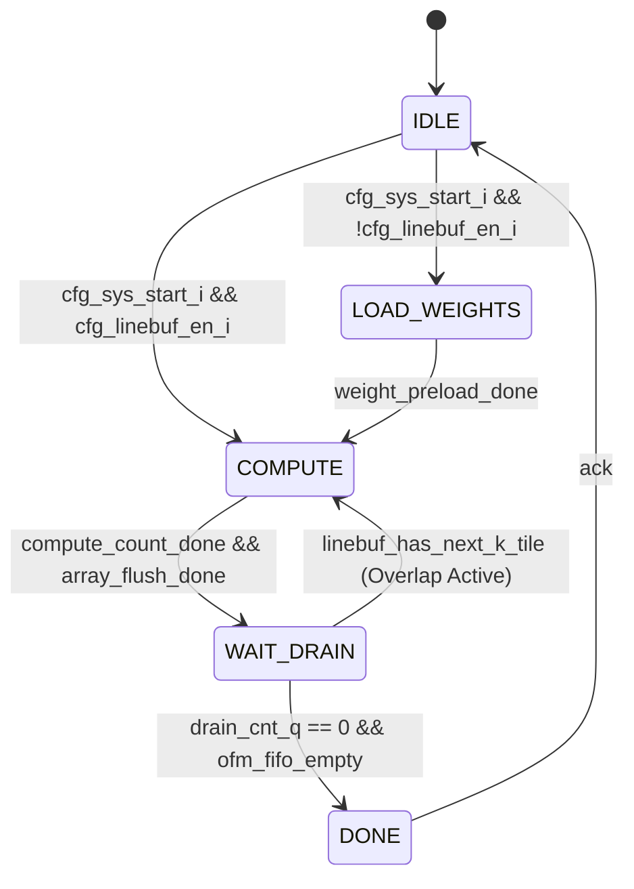

# Systolic Array Architecture Specification

**Version**: Phase 3B-A — Matrix Engine Integrated in Cluster  
**Last Updated**: 2026-07-08  

---

## 1. Architectural Overview

The **Systolic Array** (Matrix Engine) is a high-performance 2D processing array designed for dense Matrix Multiplication (MatMul) and 2D Convolutions (Conv2D), optimizing INT8 quantized inference operations. Integrated directly within the NPU Cluster, it interfaces with the RISC-V RV32IMAC control core (Snitch) via an OBI-based MMIO register block and accesses L1 Shared TCDM memory through dedicated OBI Master ports.

```mermaid
graph TD
    subgraph "NPU Cluster (L1 Area)"
        Snitch["Control Core (Snitch)"]
        Regs["Systolic Register Block (MMIO)"]
        TCDM["Shared Data TCDM (L1 SRAM)"]
        LB["Linebuffer (Stream Packer)"]
        SysCtrl["Systolic Controller"]
        SysArray["32x32 Systolic Array"]
        Requant["Requantization Pipeline"]
    end

    Snitch -->|OBI Write/Read| Regs
    Regs -->|Config Signals| SysCtrl
    SysCtrl -->|OBI Master 1x Read| TCDM
    LB -->|Prefetch/Taps| TCDM
    LB -->|IFM Stream (C32)| SysCtrl
    SysCtrl -->|Weights & IFM| SysArray
    SysArray -->|OFM (INT32)| Requant
    Requant -->|OFM (INT8)| SysCtrl
    SysCtrl -->|OBI Masters 4x Write| TCDM
```

---

## 2. Microarchitecture

### 2.1 Systolic Array Core
- **Array Dimension (`ARRAY_DIM`)**: $32 \times 32$ Processing Elements (PEs).
- **Arithmetic Precision**: 
  - **Inputs**: INT8 ($1 \times 256$-bit vector containing 32 elements).
  - **Outputs/Accumulators**: INT32 ($1 \times 1024$-bit vector containing 32 elements).
- **Dataflow Pattern**: Weight-Stationary.
  - Weights are loaded into internal PE registers during the `LOAD_WEIGHTS` phase.
  - Activation (IFM) streams flow horizontally through the array.
  - Partial sums flow vertically down the array, accumulating column results.
- **Array Flush Latency**: 64 cycles ($2 \times \text{ARRAY\_DIM}$). Activations take 32 cycles to propagate, and the final results take another 32 cycles to drain out of the pipeline.

### 2.2 Systolic Controller FSM
The controller orchestrates execution through a main Finite State Machine (FSM):



- **`IDLE`**: Awaiting start trigger (`cfg_sys_start_i`).
- **`LOAD_WEIGHTS`**: Pre-loading weights from TCDM into the array PE registers (used when linebuffer is bypassed).
- **`COMPUTE`**: Feeding IFM and weights into the array. If the Linebuffer is enabled, weight loading is overlapped with compute or done in `WAIT_DRAIN`.
- **`WAIT_DRAIN`**: Waiting for the arithmetic pipeline to flush and the final outputs to be written back to TCDM or stored in the PSum buffer.
- **`DONE`**: Asserts interrupt pulse (`cfg_sys_done_o`) and transitions back to `IDLE`.

### 2.3 Parallel Drain Engine
To prevent serializing the compute and writeback stages, a decoupled **Drain Engine** operates asynchronously beside the main FSM, managing backpressure using an `OFM FIFO` (depth = 128).

- **FSM States**:
  - **`DRAIN_IDLE`**: Idle or waiting for OFM FIFO data.
  - **`DRAIN_ACCUM_READ`**: Reading partial sums from TCDM or on-chip buffer to accumulate with current OFM row.
  - **`DRAIN_ACCUM_WRITE`**: Storing accumulated rows back to TCDM.
  - **`DRAIN_ACCUM_REQUANT`**: Feeding data into the requantization pipeline for final INT8 quantization.

### 2.4 On-Chip Memories & Buffers
1. **Partial Sum Buffer (PSum Buffer)**:
   - **Size**: 64 KiB, organized as dual-bank SRAM.
   - **Capacity**: Holds 256 M-rows of INT32 partial sums on-chip.
   - **Purpose**: Eliminates external TCDM read/write traffic during non-final $K$-tile accumulations.
2. **Weight FIFO / IFM FIFO**:
   - **Depth**: 4 entries each.
   - **Purpose**: Decouples OBI reads from the systolic core input ports, absorbing memory latency jitter.
3. **OFM FIFO**:
   - **Depth**: 128 entries of INT32 output rows.
   - **Purpose**: Decouples systolic core calculation from TCDM writeback latency.

### 2.5 Requantization Pipeline
Converts internal 32-bit INT32 accumulation results into INT8/UINT8 activation outputs.
- **Inputs**: 32 lanes of INT32 values.
- **Parameters (configurable per channel)**:
  - **Bias**: 32-bit INT32 offset.
  - **Multiplier**: 32-bit scale factor.
  - **Shift**: 8-bit right-shift amount.
  - **Zero Point**: 32-bit offset mapping to quantized zero.
- **Activation Fusion**: Built-in saturation clamps (`clamp_min`, `clamp_max`) allow fused ReLU or clipping.

---

## 3. Features & Execution Modes

### 3.1 Bypass Path (Pointwise 1x1)
For Pointwise ($1 \times 1$) convolutions with zero padding, the Linebuffer is bypassed. Activations are read directly from TCDM via OBI and fed directly into the array, avoiding SRAM buffer copy overhead.

### 3.2 Coalesced Fast Path
For small-channel convolutions satisfying:
$$\text{Kernel Height} \times \text{Kernel Width} \times \text{Input Channels} \le 32$$
The linebuffer packs the entire spatial window into a single 256-bit vector using K-major layout (`{kh, kw, ic}`). This allows the array to compute one output pixel per cycle.

### 3.3 KGEN Mode (Kernel Generator)
For $K > 32$, instead of scheduling multiple individual array launches, Snitch programs a hardware **KGEN** seed and $K$-tile count. The systolic controller:
- Autonomously sweeps through $K$-tiles.
- Generates 32 lane descriptors internally per tile.
- Ping-pongs weights and accumulates results on-chip using the PSum buffer.
- Substantially reduces Snitch interrupt handling and MMIO programming overhead.

### 3.4 Row-Ring / Host-Descriptor Spatial Scheduling

The current implementation does **not** use a large Stripe-Stationary resident
cache that stores a full `16x16xC` tile. That path was removed from the active
performance plan. Instead:

- The RTL stream linebuffer keeps a small row-ring/window state sized by
  `K_MAX`/`STRIDE_MAX`, not a full activation tile.
- Host/Python decomposes the output tensor into spatial micro-tiles and emits
  full linebuffer/GEMM job descriptors.
- Snitch firmware does not run a heavy `oh_base/ow_base` planner loop in the
  Micro-YOLO hot path; it dispatches precomputed job descriptors.
- The descriptor runner preloads the next linebuffer and GEMM shadow registers
  while the current job is running.
- For C32-aligned tensors the RTL `C32_FAST` path avoids byte merge logic on
  the main data path. Non-aligned/RGB/tail cases still use the generic
  `merge_beats` correctness path.

---

## 4. Port Interconnections

The Systolic Controller functions as a bus master containing **1x Read Master** and **4x Write Masters** using the Open Bus Interface (OBI) protocol:

```text
       +-----------------------+              +-------------------------+
       |                       |  obi_i_req   |                         |
       |                       |------------->|                         |
       |  Systolic Read Master |  obi_i_gnt   |                         |
       |       (1x OBI)        |<-------------|                         |
       |                       |  obi_i_rdata |   Shared Data TCDM      |
       |                       |<-------------|      (L1 SRAM)          |
       +-----------------------+              |                         |
                                              |                         |
       +-----------------------+  obi_o_req   |                         |
       |                       |------------->|                         |
       | Systolic Write Master |  obi_o_gnt   |                         |
       |       (4x OBI)        |<-------------|                         |
       |                       |  obi_o_wdata |                         |
       |                       |------------->|                         |
       +-----------------------+              +-------------------------+
```

- **Read Port (1x OBI - 256-bit)**: Shared between weight loading and direct IFM prefetch.
- **Write Ports (4x OBI - 256-bit each)**: Aggregated to write a complete 1024-bit accumulated output row in a single clock cycle.

---

## 5. Register Map (MMIO)

All registers are 32-bit wide, mapped to the cluster control aperture.

| Offset | Register Name | Access | Reset Value | Description |
| :--- | :--- | :---: | :---: | :--- |
| `0x0100` | `REG_SYS_W_PTR` | R/W | `0x0` | Weight base pointer in TCDM. |
| `0x0104` | `REG_SYS_I_PTR` | R/W | `0x0` | IFM base pointer in TCDM (used when Linebuffer is bypassed). |
| `0x0108` | `REG_SYS_O_PTR` | R/W | `0x0` | OFM base pointer in TCDM. |
| `0x010C` | `REG_SYS_DIM_M` | R/W | `0x0` | Output spatial length $M$ to compute. |
| `0x0110` | `REG_SYS_START` | W | `0x0` | Start trigger. Write `1` to launch FSM. |
| `0x0114` | `REG_SYS_DONE` | R/W | `0x0` | Done flag. Cleared by writing `0`. |
| `0x0118` | `REG_SYS_PSUM_PTR` | R/W | `0x0` | Partial sum base pointer in TCDM. |
| `0x011C` | `REG_SYS_ACCUM_CTRL` | R/W | `0x0` | Bit [0]: Enable accumulation from previous partial sums. |
| `0x0120` | `REG_RQ_CTRL` | R/W | `0x0` | Bit [0]: Enable Requantization pipeline. |
| `0x0124` | `REG_RQ_CMIN` | R/W | `0xFFFF_FF80`| Requantization clamp minimum value (Default: `-128`). |
| `0x0128` | `REG_RQ_CMAX` | R/W | `0x0000_007F`| Requantization clamp maximum value (Default: `127`). |
| `0x0200` | `REG_RQ_BIAS_BASE` | R/W | `0x0` | Base address of bias vectors (32 registers, 1 per PE column). |
| `0x0280` | `REG_RQ_MULT_BASE` | R/W | `0x0` | Base address of multiplier vectors (32 registers). |
| `0x0300` | `REG_RQ_SHIFT_BASE`| R/W | `0x0` | Base address of shift scale vectors (32 registers). |
| `0x0380` | `REG_RQ_ZP_BASE` | R/W | `0x0` | Base address of zero-point vectors (32 registers). |
| `0x0400` | `REG_LB_CTRL` | R/W | `0x0` | Bit [0]: Enable Linebuffer.<br>Bit [1]: Enable Coalesced Mode.<br>Bit [2]: Enable KGEN. |
| `0x0404` | `REG_LB_INPUT_BASE`| R/W | `0x0` | Input feature map base address in TCDM. |
| `0x0408` | `REG_LB_INPUT_H` | R/W | `0x0` | Input height (16-bit). |
| `0x040C` | `REG_LB_INPUT_W` | R/W | `0x0` | Input width (16-bit). |
| `0x0410` | `REG_LB_INPUT_C` | R/W | `0x0` | Input channels (16-bit). |
| `0x0414` | `REG_LB_OUTPUT_W` | R/W | `0x0` | Target output width (16-bit). |
| `0x0418` | `REG_LB_STRIDE` | R/W | `0x0001_0001`| Stride parameters: Bits [15:0]: Stride Height; Bits [31:16]: Stride Width. |
| `0x041C` | `REG_LB_PAD` | R/W | `0x0` | Padding parameters: Bits [15:0]: Pad Height; Bits [31:16]: Pad Width. |
| `0x0428` | `REG_LB_ROW_STRIDE`| R/W | `0x0` | Memory byte offset between consecutive input rows. |
| `0x042C` | `REG_LB_PIXEL_STRIDE`|R/W| `0x0` | Memory byte offset between consecutive input pixels. |
| `0x0430` | `REG_LB_OW_STEP` | R/W | `0x0` | Linebuffer offset step per output width step. |
| `0x0434` | `REG_LB_OH_STEP` | R/W | `0x0` | Linebuffer offset step per output height step. |
| `0x0438` | `REG_LB_KERNEL` | R/W | `0x0003_0003`| Kernel parameters: Bits [15:0]: Kernel Height; Bits [31:16]: Kernel Width. |
| `0x043C` | `REG_LB_C_BASE` | R/W | `0x0` | Channel base offset (16-bit). |
| `0x0440` | `REG_LB_SPATIAL_M` | R/W | `0x0` | Spatial length calculated by linebuffer ($OH \times OW$). |
| `0x0444` | `REG_LB_LANE_BASE` | R/W | `0x0` | Internal byte shift selector (6-bit). |
| `0x0448` | `REG_LB_K_TILES` | R/W | `0x0` | Total number of $K$-tiles to process. |
| `0x044C` | `REG_LB_K_SEED` | R/W | `0x0` | Hardware seed for KGEN: Bits [15:0]: Seed IC; Bits [23:16]: Seed KW; Bits [31:24]: Seed KH. |
| `0x045C` | `REG_LB_PRECOMP0` | R/W | `0x0` | Host/compiler precomputed `block_valid_bytes`; used by C32 fast and generic tail handling. |
| `0x0460` | `REG_LB_CHANNEL_OFFSET` | R/W | `0x0` | Byte offset from linebuffer input base to the active channel block. Must be 32B aligned for `C32_FAST`. |
| `0x0464` | `REG_LB_COALESCE_K_BYTES` | R/W | `0x0` | Precomputed `kernel_h * kernel_w * block_valid_bytes` for coalesce/KGEN decisions. |

---

## 6. Limits & Constraints

1. **Kernel Dimensions**:
   - Native support is strictly restricted to filters ranging from $1 \times 1$ up to $5 \times 5$ (including asymmetric variations like $1 \times 5$ or $5 \times 1$).
   - Large vision kernels ($7 \times 7$ or $9 \times 9$) are unsupported and must be decomposed by the compiler or handled by software-packed RVV routines.
2. **Input Width (`input_w`)**:
   - Physical line depth in SRAM is limited to **640 pixels** (unpadded).
   - Any layer tile with `input_w > 640` must be pre-striped by the scheduler.
3. **Stride Configurations**:
   - Supported native strides are **1** and **2**.
   - Pointwise ($1 \times 1$) with stride 2 is explicitly **unsupported** in the linebuffer and must use Spatz-based RVV copies.
4. **Channel Bounds**:
   - Sub-32 channel bounds (e.g., $IC=3$ in Layer 0) must be zero-padded to 32 elements in memory layout or padded by the linebuffer.
   - For optimal KGEN, the input channels $IC$ should be $\le 32$ or a multiple of 32.
   - For the C32-blocked fast path, the host descriptor must present each C32
     block as an independent view with `input_c=32`, `input_c_base=0`,
     `lane_base=0`, `pixel_stride_bytes=32`, and 32-byte aligned base/offset.
5. **Memory Port Bandwidth Limit**:
   - Because the 256-bit OBI Read Port is shared between weights and IFM, the hardware cannot execute at 1 cycle/compute in situations where weights must be loaded continuously. 
   - The execution speed is bounded by: 
     $$\text{Theoretical Cycles} \ge \max(\text{Compute\_Cycles}, \text{Weight\_Load\_Cycles}) + \text{Overhead}$$
     Making the practical limit $\approx 2\times$ Compute Cycles for weight-heavy tiles.
